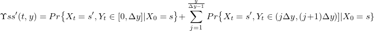
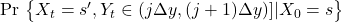

# Docs Markovian Approximation

## Formula Dasar

Perhitungan joint distribution dapat dikalkulasi menggunakan formula : 


Kemudian, _aproximation_ dapat dilakukan pada bagian rumus : 



Formula yang di _aproximation_ merupakan transient probability $Π(t)_{(s,0)(s',j)}^{Q{\infty}}$ ketika di suatu state $(s',j)$ di waktu $t$ yang telah dimulai pada saat state $(s, 0)$.

Nilai matriks $\mathbf{Q}^{\infty}$ dibentuk dari matriks $\mathbf {Q}$ dan $\mathbf {D}$.  Nilai matriks $\mathbf{Q}$ dihitung dari $\mathbf {R}$ (matriks rate/matriks transisi dari suatu state ke state) dan matriks $\mathbf {D}$ adalah matriks dengan nilai diagonal utamanya dari vektor reward $ \rho$.

Berikut formula untuk menghitung nilai matriks generator $\mathbf {Q}$:

$$ Q_{ss'} = \left\{ 
  \begin{array}{ c l }
    R_{ss'}                 & \quad {s \neq s'} \\
    -\sum_{z\neq s} R_{ss'} & \quad {s = s'}
  \end{array}
\right. $$

Selanjutnya, untuk matriks $\mathbf {D}$ dapat dibentuk dari vektor reward $\rho$ , 

$$ D = diag(\rho) $$

Perhitungan $Π(t)$ secara efektif dapat dilakukan dengan uniformisation karena pada formula


$$ Π(t) = Π(0) . e^{Qt} = \sum_{n=0}^{\infty} \frac{(Qt)^n}{n!}  \quad  \textrm{, dimana nilai } { Π(0) = {\mathbf {I}}} $$

komputasi matriks exponential untuk $\mathbf Q$ tidak _feasible_. Maka, dapat didefinisikan matrix $\mathbf U$ (stochastic matrix):

$$ \mathbf {U} = \mathbf {I} + \frac{1}{\lambda} \mathbf {Q} \quad \rightarrow \quad \mathbf {Q} = \lambda(\mathbf {U} - \mathbf {I}) \quad , \lambda = max(diag(\mathbf {Q}))$$

Sehingga,

$$ \begin{split}
    Π(t) & = e^{\lambda( \mathbf {U} - \mathbf {I})t} \\
         & = e^{-\lambda t} . e^{\lambda t \mathbf {U}} \\
        & = \sum_{z\neq s}^{\infty}  e^{-\lambda t} \frac{(\lambda t)^n}{n!} . \mathbf {U}^n \quad , \textrm { nilai } \mathbf {U}^0 = \mathbf {I}, \mathbf {U}^n = \mathbf {U}^{n-1}. \mathbf {U}
\end{split}$$

Pada formula diatas, nilai $e^{-\lambda t} \frac{(\lambda t)^n}{n!}$ adalah $PP$ atau poisson probability. 

Maka menjadi,

$$
    Π(t) = \sum_{n=0}^{N} PP(-\lambda t, n). \mathbf {U}^n
$$

Agar perhitungan tidak sampai nilai $N$, maka dapat menggunakan error bound yang dihitung secara apriori melalui:

$$
\varepsilon = 1 - \sum_{n=0}^{N} PP(-\lambda t, n)
$$


## Implementasi Algoritme dan Contoh Perhitungan

Simulasi diambil dari [1]. 


Terdapat 4 state dan 6 transisi, dengan nilai reward $\rho = (50, 20, 100, 0)$. Initial distribution yang ditetapkan adalah $\alpha = (1, 0, 0, 0)$ , lalu nilai $t=0.2$ dan $y=5$


Untuk melakukan perhitungan joint distribution dengan menggunakan markovian approximation dapat dilakukan dengan step berikut:

1. Mendefinisikan rate matriks $\mathbf {R}$ pada `.tra` file

```
STATES 4
TRANSITIONS 6
1 2 3
1 3 6
1 4 1
2 1 2
3 1 8
4 1 1
```

2. Mendefinisikan initial distribution pada `.pi` file

```
1 1
```

3. Mendefinisikan reward rate pada `.rew` file

```
1 50
2 20
3 100
```

4. Menjalankan simulasi berdasarkan parameter diatas dengan memanggil file `main.py`

```
python main.py -t samples/game.tra -r samples/game.rew -p samples2/game.pi -d 0.1 -tm 0.2 -ym 5 -e 0.01 -o sample-out.txt
```

-t  merupakan argument untuk memasukan nilai path file `.tra` 

-r  merupakan argument untuk memasukan nilai path file `.rew` 

-p  merupakan argument untuk memasukan nilai path file `.rew` 

-d merupakan argument untuk memasukan nilai `delta`

-tm merupakan argument untuk memasukan nilai `t_max`

-ym merupakan argument untuk memasukan nilai `y_max`

-e  merupakan argument untuk memasukan nilai `epsilon`

-o  merupakan argument untuk memasukan path output file yg akan menyimpan hasil transient distribution


5. Program akan membaca  `.tra`, `.rew` dan `.pi` file, lalu meneruskan argument lain seperti `delta`, `t_max` , `y_max` dan `epsilon` untuk inisiasi class `MarkovianApproximation`. Kemudian memanggil fungsi `compute_joint_distribution` untuk mendapatkan nilai $\Upsilon$. 


## Hasil

Hasil yang diperoleh dari simulasi diatas dengan $\varepsilon = 0.001$

| $\Delta y$      | $\Upsilon_{(s,s')}(0.2,5)$       | Time (s)    |
| --------------- | -------------------------------- |------------ |
| $10^{-1}$       | 0.1216920492                     | 0.047       |
| $10^{-2}$       | 0.1225317816                     | 0.398       |
| $10^{-3}$       | 0.1227338469                     | 15.109      |


Error ketika tidak bsa mengalokasikan memori untuk menyimpan data

```
numpy.core._exceptions.MemoryError: Unable to allocate 298. GiB for an array with shape (200000, 200000) and data type float64
```


## Referensi

[1] L. Cloth and B. R. Haverkort, “Five Performability Algorithms: A Comparison,” in MAM 2006: Markov Anniversary Meeting, Jun. 2006, pp. 39–54. Accessed: Sept. 10, 2022. [Online]. Available: https://research.utwente.nl/en/publications/five-performability-algorithms-a-comparison 

[2] L. Cloth, “Model Checking Algorithms for Markov Reward Models,” phdthesis, University of Twente, Netherlands, 2006.

